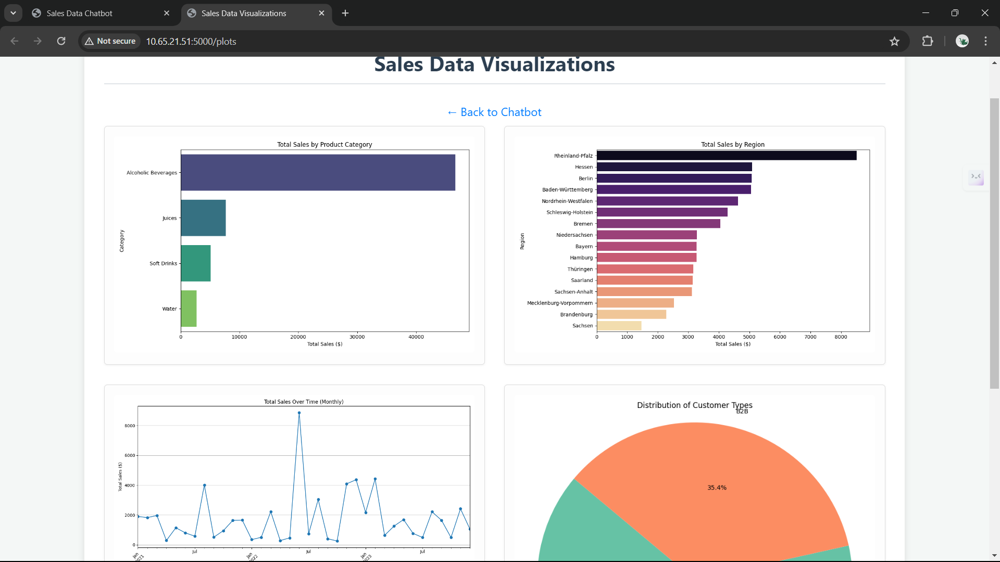

# Sales_Bot
Sure! Here's the full content for `README.md` that you can copy and paste directly into your file:

```markdown
# 🧠 Astra DB + Groq + Flask AI Assistant

This project is a Flask web application that connects to **Astra DB** and uses **Groq's LLM (Mixtral-8x7B)** to generate Python code and business insights based on **natural language queries** over your **sales data**. It also visualizes results using **Matplotlib** and **Seaborn**.

---

## ✨ Features

- 🔗 Connects directly to **Astra DB** for real-time data querying (no local file loading!)
- 💬 Supports **natural language queries** like “Show me top 5 products by revenue in Q1”
- 🤖 Uses **Groq API** to generate Python code dynamically via Mixtral-8x7B
- 📊 Visualizes insights using **Matplotlib** and **Seaborn**
- 🧪 Executes generated Python code securely and returns results

---

## 🚀 Quick Start

1. Clone the repo:

```bash
git clone https://github.com/yourusername/astra-groq-assistant.git
cd astra-groq-assistant
```

2. Install dependencies:

```bash
pip install -r requirements.txt
```

3. Set your environment variables:

```env
ASTRA_DB_SECURE_BUNDLE_PATH=path/to/your/secure-connect-database_name.zip
ASTRA_DB_KEYSPACE=your_keyspace
ASTRA_DB_TABLE=your_table
GROQ_API_KEY=your_groq_api_key
```

4. Run the Flask app:

```bash
python app.py
```

5. Open in browser:

```
http://127.0.0.1:5000/
```

---

## 🖼️ Screenshots

### 🔍 Homepage


---

### 🧠 Ask Anything Page

Ask natural language queries like:

- "Total sales by region"
- "Top 5 products by revenue"
- "Average order value in February"


---

### 📊 Visualization Example

Auto-generated plots from your queries!


---

## 🛠️ Technologies Used

- 🐍 Python
- ☁️ Astra DB
- 🌐 Flask
- 🤖 Groq (Mixtral-8x7B)
- 📈 Matplotlib & Seaborn

---

## 📦 Folder Structure

```
astra-groq-assistant/
│
├── app.py
├── templates/
│   ├── index.html
│   └── ask.html
├── static/
│   └── images/
├── requirements.txt
└── README.md
```

---

## 📌 Todo

- [ ] Improve error handling for malformed queries
- [ ] Add support for multiple tables
- [ ] Secure code execution sandbox

---

## 🧑‍💻 Author

**Your Name** – [@yourhandle](https://github.com/adityasingh0912)

---

## 🪪 License

This project is licensed under the MIT License.
```

Let me know if you want the image links updated to public URLs or want a version tailored for GitHub Pages.
